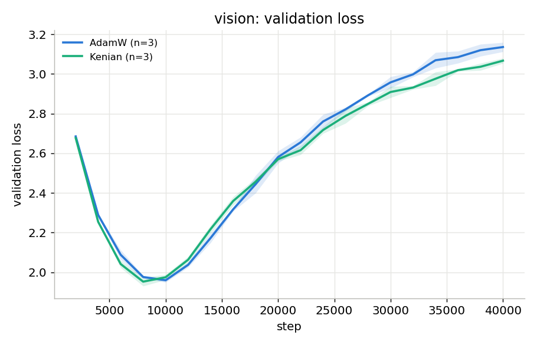
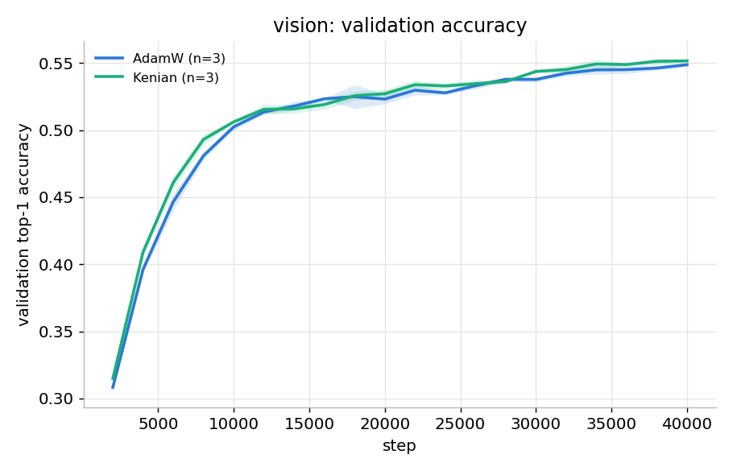
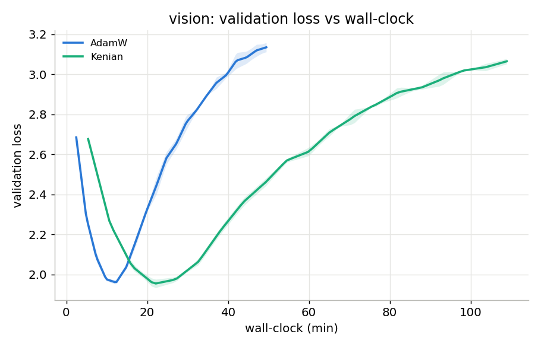
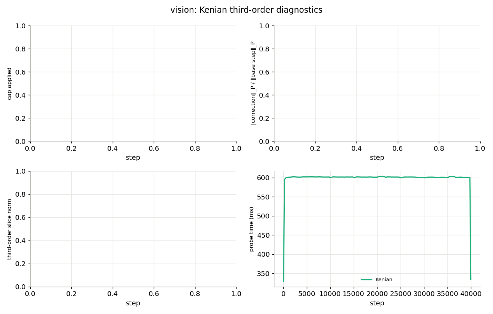
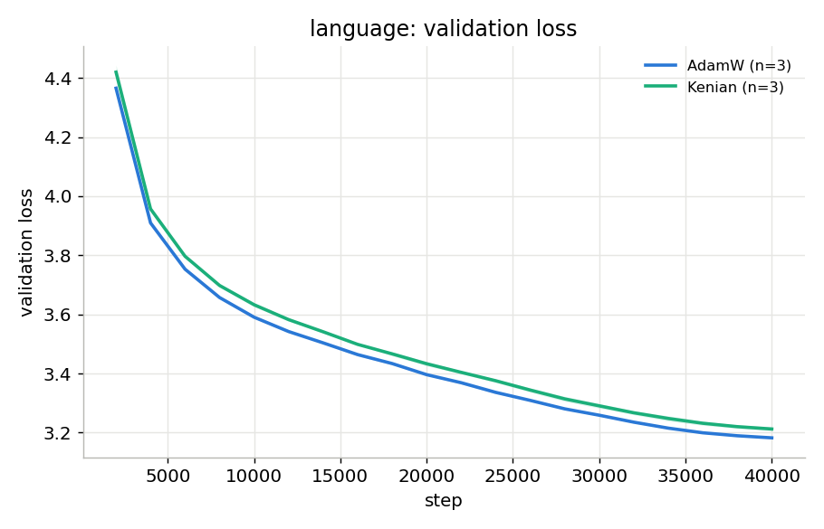
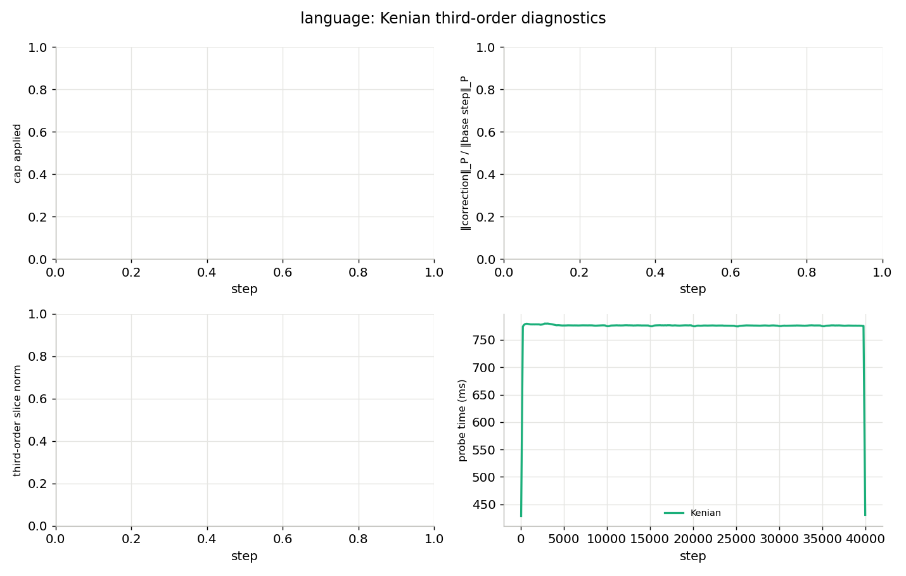

# Kenian

Kenian is an experimental PyTorch optimizer that adds a small, capped
third-order correction to AdamW. It is a research implementation, not a
general replacement for AdamW.

The optimizer never builds a full third-derivative tensor. Instead, it
periodically evaluates the exact directional slice `∇³L[Δ, Δ, ·]` along its
own base update `Δ`, keeps an exponential moving average of that slice, and
uses it as a bounded correction.

## Project layout

```text
src/        Optimizer, update backends, training, data, and analysis code
kernels/    Optional fused CUDA extension
tests/      Optimizer, mathematical, and backend checks
lean/       Lean 4 proofs for the core identities
results/    Experiment logs and figures
theory.md   Method note
report.md   Experiment report
```

## Install and test

The reference optimizer requires PyTorch. CUDA backend tests also require a
supported NVIDIA GPU; they are skipped automatically on CPU-only machines.

```bash
python -m pytest -q
```

## Training

Run either the AdamW baseline or Kenian with the same trainer:

```bash
python src/train.py --task vision --optimizer adamw --lr 1e-4 --amp
python src/train.py --task vision --optimizer kenian --lr 1e-4 --correction-cap 0.1 --amp
```

Kenian-specific options:

- `--probe-interval`: number of optimizer steps between third-order probes
  (default: 10).
- `--probe-batch`: optional smaller batch for a full-precision probe.
- `--correction-cap`: maximum correction size relative to the base step in
  the preconditioned norm (default: 0.1).

`--backend torch` selects the reference update. `triton` and `cuda` select
optional fused CUDA implementations.

## Results in this repository

Kenian was evaluated on two distinct benchmarks across three random seeds and 40,000 training steps: a Vision Transformer (ViT-Base with GELU activations) on CIFAR-100 and a Decoder-only Transformer on WikiText-103.

| Benchmark | AdamW validation loss | Kenian validation loss | Outcome |
|---|---:|---:|---|
| **Vision (CIFAR-100 / ViT)** | 3.135 ± 0.023 | **3.067 ± 0.013** | Kenian improved loss |
| **Language (WikiText-103 / Transformer)** | **3.182 ± 0.003** | 3.212 ± 0.006 | Kenian was worse |

---

### Vision Benchmark (CIFAR-100 / ViT)

On continuous vision representations, Kenian consistently outperforms AdamW across validation metrics.


*Figure 1: Validation loss on CIFAR-100 over 40,000 steps (mean and std across 3 seeds). Kenian reaches a lower final validation loss than AdamW.*


*Figure 2: Validation accuracy on CIFAR-100. Kenian achieves higher top-1 accuracy throughout training.*


*Figure 3: Validation loss versus wallclock time. Probing $\nabla^3 L$ every 10 steps adds compute overhead, but Kenian still achieves lower loss within equal runtime.*


*Figure 4: Kenian internal diagnostics during vision training: tracking the third-order slice norm $\sqrt{\sum \|\hat{\kappa}\|^2}$, correction norm, ratio to AdamW base step, and cap activation rate.*

#### What is going on in Vision?
* **Stable Curvature Signal:** In vision models with smooth activations (GELU), the third-order trajectory slice $\nabla^3 L[\Delta, \Delta, \cdot]$ remains non-zero, smooth, and informative throughout training.
* **Effective Chebyshev Correction:** The moving average of the directional slice $\hat{\kappa}$ accurately measures local curvature change, steering parameter updates toward flatter, higher-quality minima.
* **Bounded Impact:** The preconditioned cap (set to 0.1) prevents runaway updates while allowing the third-order correction to refine step directions effectively.

---

### Language Benchmark (WikiText-103 / Transformer)

On discrete language modeling, Kenian exhibits a trade-off where probe noise outweighs curvature benefits.


*Figure 5: Validation loss on WikiText-103. AdamW achieves lower loss than Kenian.*


*Figure 6: Kenian internal diagnostics on language modeling.*

#### What is going on in Language?
* **Vanishing Signal & Stochastic Noise:** In the language transformer, the true third-order directional slice is near zero for long stretches of training. 
* **Noise Amplification:** Because stochastic minibatch gradients fluctuate heavily in discrete text domains, probing $\nabla^3 L$ captures stochastic noise rather than true structural curvature. 
* **Perturbation Penalty:** Even though the correction is bounded by the global cap, applying a noisy correction step acts as a persistent perturbation, degrading AdamW's performance.

#### Key Takeaway & Future Work
Third-order trajectory slicing works effectively in continuous, smooth landscapes (Vision), but requires a **signal-quality gate** for noisy, discrete landscapes (Language)—applying the correction only when the signal-to-noise ratio of the estimated slice $\hat{\kappa}$ exceeds a statistical significance threshold.

The full setup, raw logs, and extended analysis are in [report.md](report.md).

## Formal checks

The Lean development formalizes the identities used to motivate the method,
including the third-order Taylor term, the capped-correction descent bound,
and the softmax cross-entropy cumulant relation.

```bash
cd lean
lake build
```

## Development and Agentic Co-pilot (GPT-5.6 Sol)

This repository and the underlying optimizer were developed in collaboration with **GPT-5.6 Sol on Ultra** acting as an autonomous agentic partner. While I provided the core ideas and conceptual directions, the agent executed the implementation loops:
- **Mathematical Proofs:** Formulating and writing the Lean 4 formal verification code to prove Chebyshev safety bounds and Taylor series error behaviors.
- **CUDA & Triton Backends:** Writing high-performance GPU kernels for the elementwise updates, ensuring they matched the PyTorch reference implementation.
- **Scientific Honesty & Empirical Rigor:** Setting up test suites, running multi-seed benchmarks, and accurately reporting results without hallucination. Rather than fabricating uniform improvements, GPT-5.6 Sol faithfully reported that while Kenian won on Vision Transformers (3.067 vs 3.135), it performed worse on Language Transformers (3.212 vs 3.182). This unvarnished feedback was crucial in diagnosing the noise dynamics and identifying the need for a signal-quality gate.

## License

Apache License 2.0. See [LICENSE](LICENSE).
